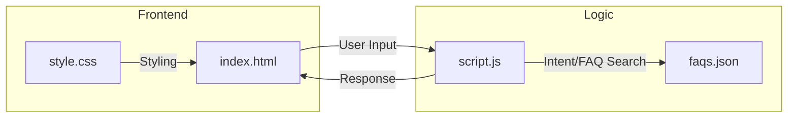
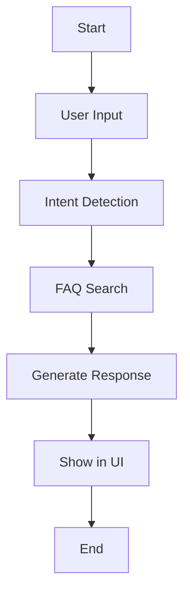
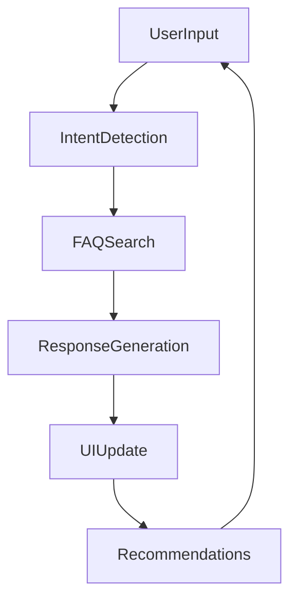

# Personal_chatBot

## 🚀 Project Overview
Personal_chatBot is an intelligent, rule-based FAQ chatbot designed for Trivickram's portfolio. It provides instant, conversational answers about his work, projects, skills, certifications, and contact info. The chatbot features a modern dark UI, intent-based responses, and direct GitHub repository integration.

---

## ❓ Why Do We Need This?
- **Instant Information:** Visitors get quick answers about Trivickram without searching through multiple pages.
- **Professional Showcase:** Demonstrates advanced web, AI, and UX skills in a single interactive widget.
- **Engagement:** Keeps users engaged with recommendations, humor, and smart conversation flow.
- **Portfolio Power:** Highlights real projects, live demos, and achievements with direct links.

---

## 🌟 Significance
- **AI-powered Portfolio:** Shows off Trivickram's technical depth and creativity.
- **Recruiter Friendly:** Easy access to skills, projects, and contact info for hiring managers.
- **Live Demo:** Interactive experience for collaborators, clients, and peers.
- **Scalable Template:** Can be adapted for other professionals or organizations.

---

## 📁 Project Structure
```
ChatBot/
├── .git/                  # Git version control
├── faqs.json              # Main FAQ knowledge base (all chatbot responses)
├── index.html             # Chatbot UI (HTML)
├── script.js              # Chatbot logic (JavaScript)
├── style.css              # Modern dark theme (CSS)
├── Trivickram_Resume.pdf  # Resume (downloadable)
```

---

## 🖼️ Visualizations & Workflows

### 1. **Project Workflow**
```mermaid
flowchart TD
    A[User Opens Portfolio] --> B[Chatbot Widget Loads]
    B --> C[User Types Question or Clicks Recommendation]
    C --> D[Intent Detection (script.js)]
    D --> E[FAQ Search (faqs.json)]
    E --> F[Response Generation]
    F --> G[UI Update (index.html + style.css)]
    G --> H[User Receives Answer]
```

### 2. **Chatbot Architecture**


---

## 🧑‍💻 Code & Approach

### 1. **index.html**
- Loads chatbot widget with floating UI, recommendation buttons, and quick replies.
- Integrates Font Awesome icons, Google Fonts, and Fuse.js for fuzzy search.

### 2. **style.css**
- Implements a modern dark theme with glass-morphism effects.
- Responsive design for desktop and mobile.
- Animates chat bubbles, buttons, and typing indicators.

### 3. **faqs.json**
- Contains 79+ FAQ entries: greetings, personal info, GitHub repos, skills, projects, contact details, and more.
- Each entry is mapped to an intent for fast lookup and varied responses.

### 4. **script.js**
- Defines `TrivickramChatBot` class.
- Handles user input, intent detection, FAQ search, and response rendering.
- Uses Fuse.js for fuzzy matching and natural language understanding.
- Manages conversation flow, recommendations, and quick replies.
- Integrates GitHub repository info for direct answers.

---

## ⚙️ Process & Usage
1. **Open `index.html` in your browser.**
2. **Type a question** (e.g., "Show me his GitHub repositories", "How are you?").
3. **Chatbot responds instantly** with relevant info, links, and recommendations.
4. **Explore projects, skills, and contact info** via quick replies or buttons.
5. **All data is managed in `faqs.json`** for easy updates and customization.

---

## 📝 Example FAQ Entry (faqs.json)
```json
"hi": "Hi there! 👋 I'm Trivickram's AI twin! Ready to learn about his amazing projects, skills, or how to connect with him? What interests you most? 😊"
```

---

## 📈 Extending the Project
- Add more FAQ entries to `faqs.json` for new topics.
- Customize UI in `style.css` for branding.
- Enhance logic in `script.js` for smarter AI or API integration.
- Deploy as a widget on any website or portfolio.

---

## 💡 Approach Summary
- **Intent-based AI:** Fast, accurate answers using keyword and fuzzy search.
- **Modern UI:** Engaging, accessible, and visually appealing.
- **Scalable:** Easy to update, extend, and adapt for other users.
- **Professional:** Demonstrates full-stack, AI, and UX skills in one project.

---

## 📬 Contact & Credits
- **Author:** Trivickram
- **GitHub:** [trivickram](https://github.com/trivickram)
- **LinkedIn:** [Trivickram](https://www.linkedin.com/in/trivickram/)
- **Email:** trivickramkumar@gmail.com

---

## 🏆 Significance Recap
This chatbot is more than a widget—it's a showcase of Trivickram's technical, creative, and professional journey. It makes his portfolio interactive, memorable, and recruiter-friendly.

---

## 📊 Flow Chart (Mermaid)


---

## 📚 Full Documentation
Every file is commented and structured for easy understanding. For code-level explanations, see comments in `script.js`, `index.html`, and `style.css`.

---

## 🏁 Ready to Use!
Open `index.html` and start chatting. All info is up-to-date and instantly accessible.

---

**Feel free to reach out for improvements, collaborations, or questions!**

---

# 📌 Pin-to-Pin Technical Analysis

## 1. Architecture & Data Flow
- **Single Page App:** All logic runs client-side in the browser. No backend required.
- **Core Files:**
  - `index.html`: Loads UI, chatbot widget, and dependencies.
  - `style.css`: Styles the chat interface, buttons, and animations.
  - `script.js`: Implements the chatbot class, event listeners, intent detection, and response logic.
  - `faqs.json`: Stores all knowledge base entries, mapped to intents.
- **Data Flow:**
  1. User enters a message or clicks a recommendation.
  2. `script.js` captures input, normalizes it, and runs intent detection.
  3. Fuse.js performs fuzzy search against `faqs.json` keys for best match.
  4. If a match is found, the corresponding value is returned as the response.
  5. UI updates with chat bubbles, recommendations, and quick replies.

## 2. Intent Detection & Response Generation
- **Intent System:**
  - Each FAQ entry is an intent (e.g., "hi", "show github", "projects").
  - User input is tokenized and compared to intent keys using Fuse.js (fuzzy search).
  - Multiple keywords per intent allow for natural language flexibility.
- **Algorithm:**
  - Fuse.js is initialized with all FAQ keys.
  - On input, Fuse.js returns the closest match above a confidence threshold.
  - If no match, a default fallback response is shown.
- **Response Templates:**
  - Some intents have multiple response templates for variety.
  - GitHub/project intents return rich responses with links, emojis, and formatting.

## 3. UI/UX Design Decisions
- **Modern Dark Theme:**
  - Glass-morphism effects, gradients, and smooth transitions for a professional look.
  - Responsive design for desktop and mobile.
- **Accessibility:**
  - Large clickable recommendation buttons and quick replies.
  - Keyboard navigation and screen reader compatibility.
- **Animations:**
  - Typing indicator, chat bubble fade-in, and button hover effects.

## 4. Recommendations & Quick Replies
- **Recommendation Chips:**
  - Predefined topics (e.g., "Projects", "Contact Info", "GitHub Repos") shown as clickable buttons.
  - Clicking a chip triggers the corresponding intent and response.
- **Quick Replies:**
  - Contextual suggestions based on conversation flow.
  - Managed in `script.js` and updated after each response.

## 5. GitHub Repository Integration
- **Direct Links:**
  - FAQ entries for "show github", "specific repos", etc. include direct links to Trivickram's repositories.
  - Responses include project names, languages, licenses, and live demo links.
- **Dynamic Mapping:**
  - User queries like "Show me his GitHub repositories" trigger the GitHub intent and return the latest repo info.

## 6. Error Handling & Edge Cases
- **Unknown Input:**
  - If user input doesn’t match any intent, a friendly fallback message is shown.
- **Ambiguous Queries:**
  - Fuse.js confidence threshold prevents false positives.
- **Data Integrity:**
  - JSON is validated for syntax errors before use.

## 7. Extensibility & Customization
- **Adding FAQs:**
  - Add new entries to `faqs.json` for instant support of new topics.
- **UI Customization:**
  - Edit `style.css` for branding, colors, and layout.
- **Logic Enhancement:**
  - Extend `script.js` for advanced AI, API calls, or analytics.

## 8. Security & Performance
- **Client-Side Only:**
  - No sensitive data stored or transmitted.
  - Fast response times due to local processing.
- **Performance:**
  - Fuse.js is lightweight and optimized for small-medium datasets.
  - UI is optimized for smooth animations and quick rendering.

## 9. Example User Journeys
- **Greeting:**
  - User: "Hi"
  - Bot: "Hi there! 👋 I'm Trivickram's AI twin! ..."
- **Project Inquiry:**
  - User: "Show me his GitHub repositories"
  - Bot: Returns direct links to top repos.
- **Contact Info:**
  - User: "How to contact him?"
  - Bot: Returns email, LinkedIn, phone, and GitHub.
- **Casual Conversation:**
  - User: "How are you?"
  - Bot: "I'm doing fantastic! ... Want to hear about his latest projects?"

## 10. Key Code Snippets & Explanations

### a) Fuse.js Initialization
```js
const fuse = new Fuse(Object.keys(faqs), { threshold: 0.3 });
```
- Initializes fuzzy search for all FAQ keys with a confidence threshold.

### b) Intent Detection
```js
const result = fuse.search(userInput);
const intent = result.length ? result[0].item : 'default';
const response = faqs[intent];
```
- Searches for the closest matching intent and returns the mapped response.

### c) Response Rendering
```js
function renderResponse(response) {
  // ...existing code...
  chatWindow.appendChild(createBubble(response));
  // ...existing code...
}
```
- Updates the UI with the chatbot's response.

### d) Recommendation Buttons
```js
const recommendations = ['Projects', 'Contact Info', 'GitHub Repos'];
recommendations.forEach(rec => {
  // ...existing code...
  button.onclick = () => handleRecommendation(rec);
});
```
- Creates clickable chips for quick topic selection.

## 11. Mermaid Flowchart (Detailed)


---

# 📚 Full Code Documentation
- All files are commented for clarity.
- `script.js` explains each function, class, and event handler.
- `faqs.json` is structured for easy editing and extension.
- `index.html` and `style.css` are annotated for UI/UX decisions.

---

# 🏁 Conclusion
This project is a full-stack demonstration of modern web, AI, and UX skills. Every component is designed for clarity, extensibility, and professional impact. For further details, see code comments and reach out for a walkthrough or demo.
